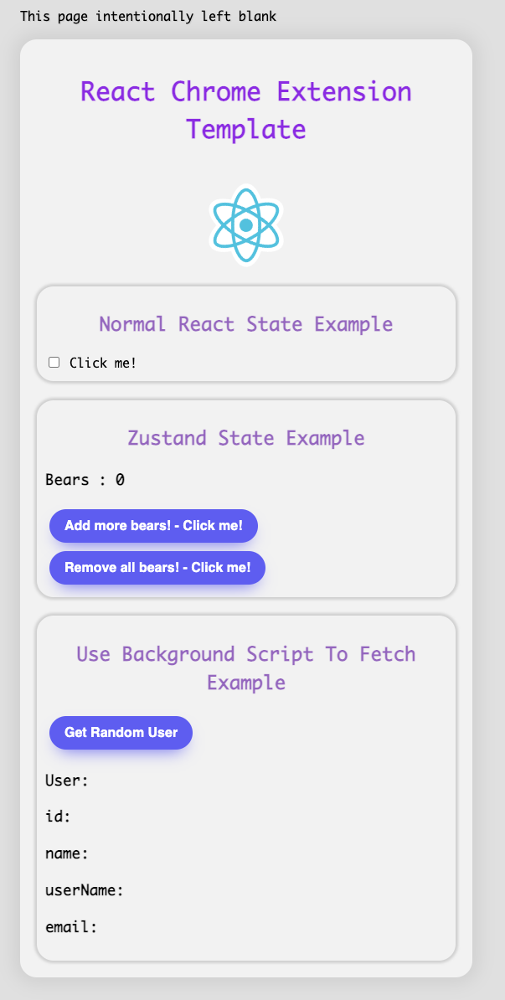

[](https://github.com/rickwillcox/react-typescript-chrome-extension-template/stargazers)

Credit: The base of this repo was cloned from [React-Content-Script](https://github.com/yosevu/react-content-script) - I've added quite a few more features including background scripts and state management.

# React TypeScript Chrome Extension Template

This comprehensive template is perfect for beginners looking to dive straight into building a Chrome Extension using React and TypeScript. It's packed with examples and guidance on injecting a React app into an existing webpage, managing state with Zustand and context, and establishing communication between background and content scripts. With all the necessary resources conveniently located in one place, you'll find that building your own Chrome Extension has never been easier. Star it if you find it useful so you can reccomend it to others.


This project uses [Vite](https://vitejs.dev/) and [crxjs](https://crxjs.dev/vite-plugin) to build the extension.

## Features added

- Background Scripts - React components can communicate with the background scripts and react to fetched data.
- State Management - Context and Zustand.
- Chokidar - Allows the files to be watched and for the transpiler to run on any changes
- Path Aliases - Allows use of `@components/App` instead of `"../../Components/App"`

Why Zustand? Its quick and easy to get up and running, strip it you dont want it.

Why Context? I am using this to receive background script messages and update that zustand stores with that data. This is what allows the components to be react. You could do this all with vanilla zustand but I wanted to keep the zustand hooks. I also wanted to keep the `chrome.runtime.sendMessage` logic out of the other components and just have them consume the stores / context.

## What you will be greated with upon installation




## Setup

### Clone repository

```sh
 git clone https://github.com/RickWillcox/react-typescript-chrome-extension-template
```

### Install dependencies

```sh
yarn
```

### Build extension

```
yarn build
```

### Build and rebuild on file save

```
yarn watch
```

### Load extension

1. Navigate to [chrome://extensions/](chrome://extensions/)
1. Turn on the "Developer mode" toggle switch in the top right of the window
1. Click the "Load unpacked" button in top left of the window
1. Go to the `react-typeScript-chrome-extension-template` directory and select the `dist` directory to load the extension
1. Navigate to [This Page](https://this-page-intentionally-left-blank.org/) to see the React Typescript Chrome Extension Template app in action!


